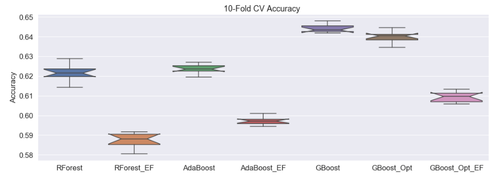
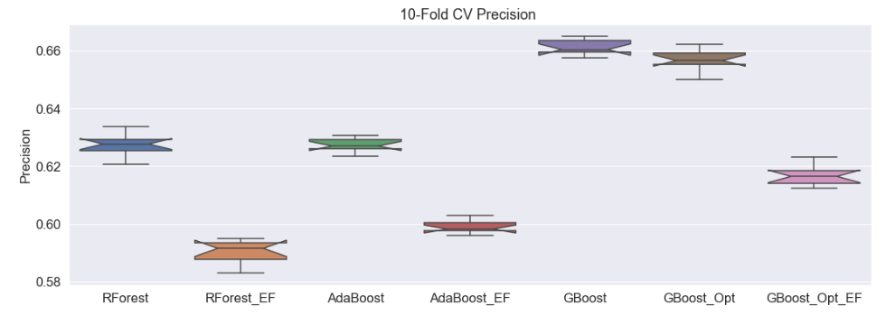

# In Depth NBA Shots Log Analysis 2014-2015 Season
NBA shots log 2014-2015 is a publicly available data set from Kaggle.

# Overview
With massive amounts of readily available data, professional sports teams, like most businesses, rely heavily on data analytics to guide their evolution.  The NBA is no different.  The game looks very different than it did 30, 20 or even 5 years ago.  In the past the game was dominated by “Big Men” who played close to the basket.  The offense was centered around getting the ball first to the center near the basket.  The center would either take the shot or pass to an open man if double teamed.  The 3-point shot was considered a risky low percentage shot. Rather than a first option, it was considered a second or third option.
	Analytics has changed the mindset and offensive strategy of many, if not all teams.  Teams began to realize the risk was worth the reward.  The idea that 3 is always greater than 2 began to take hold.  Shooting 10 3-point shots at 40% is still better than shooting 10 2-point shots at 50%.  Now teams like the Houston Rockets base their offense on a two-shot outcome.  Shoot a 3-pointer or take the highest percentage shot within 5 feet from the basket.  Teams like the Rockets have reversed the older paradigm.  They spread the floor with four shooters beyond the 3-point arc and have one “big man” under the basket.  They look to get the ball to an open 3-point shooter first to take the shot.  If the defender under the basket comes out to help defend the 3-point shooters the ball is then passed to the one person under the basket for a dunk or a lay-up.  The mid-range shot is not completely dead.  There are still players like Chris Paul and Dirk Nowitzki who are good enough shooters form anywhere on the court that they always have the green light when they are open.  Here we will look at some of the best close-range, mid-range and long-range shooters. As well as defenders.  Good defense never goes out of style.  We will also use machine learning to classify or “predict” shots made or missed and who won the game.  

# Project Structure
- The project analysis is contained in three Jupyter notebooks
- Notebook 1: Capstone.ipynb
	- Plotly analysis of 2 and 3-point shots made and missed
	- Plotly analysis of 2 and 3-point shooting percentages by game period
	- Plotly analysis of how shot distance is affected by closest defender
	- Machine learning classification of game winner or loser
- Notebook 2: Capstone Notebook 2.ipynb
	- Overall look at scorers and defenders in the NBA using Tableau dashboard
	- In depth statistical analysis of best defenders, best close, mid and long-range shooters
	- This analysis will be visualized using Tableau
- Notebook 3: Capstone Notebook 3.ipynb
  - In depth machine learning analysis to find the best model for predicting shots made and     missed
# Number of Made and Missed 2 and 3-pointers
Images in this README will be rendered as static images. Many are interactive Plotly or Tableau visualizations within the notebooks

- Overall Season 2-Point shooting Percentage = 49%
- Overall Season 3-Point shooting Percentage = 35%
- Overall 2014-2015 NBA shooting percentage = 45%
# 2- and 3-Point Shooting Percentages by Quarter or OT Period

# How Shot Distance is Affected by Closest Defender
This plot did give some insight on how the closest defender affects shot distance.  However, more interesting to me was to see the distribution of shot distances.  The three-point line is at 23.75 feet in the NBA.  You see the largest aggregation of shots close to the basket and near the three-point line.  This lends credence to my theory that these two shots ranges have become the most prevalent in the NBA.

# Gradient Boosting Classifier to Predict Game Won
- This was more for a bit of fun.  The data within this data set contains statistics related to shooting.
- It does not contain stats that are strongly skewed toward the winning or losing team such as rebound margin, turnover margin, number of steals or number of free throws taken.
- I wanted to see if we could produce a model with better than coin-flip accuracy at classifying the winner of the game.
- The overall accuracy was close to 60%.  Not bad!  But I would guess Vegas has better predictive value than my model!
- I changed margin of victory to all positive numbers so the answer would not be given away.  Not surprisingly the two most predictive features were Home team and margin of victory.

# Best Close-Range Shooters 
The interactive versions of the following four visualizations can be found in Capstone Notebook 2.ipynb.  All Tableau visualizations created for this project are also hosted here [Tableau Visualizations]( https://public.tableau.com/profile/bryan.dicarlo#!/?newProfile=&activeTab=0)

# Best Long-Range Shooters

# Best Mid-Range Shooters

# Best Defenders
Measured by percentage of shots missed while defender is guarding

# Modeling to Classify Shots Made and Shots Missed
- The correlation between target (field goals made) and the numerical features of the data set were analyzed.  Engineered features were created by combining the most positively correlated features together to form two columns (or features).  The same was done for negatively correlated features. Thus, the data set with the engineered features contained four features and the target FGM.
- Random Forest, AdaBoost and Gradient Boosting Classifier from scikit learn were used to model the data.  A model using all features and one for the engineered features were built for the Random Forest, AdaBoost Models and the Gradient Boosting Models.  A grid search to find the optimized parameters was performed.  A model using 8 features and the optimized parameters was built for the Gradient Boosting Model.
- Models using the engineered features did not fare as well as models including all features. Overfitting was not an issue for the two best models.  The two best performing models were the AdaBoost model and the Gradient Boosting Model with all features included.
- Classification report, confusion matrix and feature importance shown for top two models.
- Graph of 10-fold cross validated Accuracy, Precision and F1-Score shown for all models built

# AdaBoost Model Classification Report and Confusion Matrix

# Feature Importance for AdaBoost Model

# Gradient Boosting Classifier Classification Report and Confusion Matrix

# Gradient Boosting Classifier Feature Importance

# Graph of 10-Fold Cross Validated Accuracy All Models

# Graph of 10-Fold Cross Validated Precision All Models

# Graph of 10-Fold Cross Validated F1-Score All Models

# Conclusions: What is Our Best Model?
- To answer this question let’s start with what we know from our previous analysis.
- The overall shooting percentage in the NBA for the 2014-2015 season was 45%.
- This gives us the ground truth values that we would like to improve upon with our models.
- 55% of all shots taken were missed (class 0 in our models).
- 45% of all shots taken were made (class 1 in our models).
- Looking at the graphs of the 10-fold validation metrics it is clear the gradient boosting model performs the best.  Right?
- Yes and No.  The gradient boosting model classifies or “predicts” missed shots correctly 81% of the time. A 26% increase above the actual value.  55% of all shots were missed during this season.  This gives us valuable and useful information.  With this model, and the feature importances associated with the model, we have insight into what constitutes a “bad” shot or a shot that is likely to be missed. For instance, shot distance and closest defender were important features in this model.  Passing the ball to a player who is closer to the basket and less closely defended will likely improve the chances of making the shot.
- However, the gradient boosting model only classified made shots correctly at 48%. Just 3% above the actual value of 45% of all shots made during this season.
- It was clear from initial analysis that made shots would be the more difficult class to classify.
- I intentionally included the AdaBoost model with a decision tree base estimator.  This model focuses more on the harder to classify examples.
- With the AdaBoost model we were able to correctly classify missed shots 71% of the time.  However, we improved the classification of made shots to 54%.  And feature importances shifted.  Home game and the period the shot was taken became the most important features.  Shot distance and closest defender were still important.  Having these two added dimensions gives a better idea of what constitutes a “good” shot with a better chance of going in.
- This is a case where one model outperforms the other in classifying a particular class.  We don’t have to choose.  Each model provides important information and should be used in combination.

# Future Directions
- We only have one season of data.  Data from multiple seasons would be helpful for statistical analysis as well as building more robust models.
- To improve our model for classifying game outcome we should add more statistics that are important in determining the outcome of the game.  Rebounds, free throws, steals, turnovers and points off turnovers are all stats that are generally skewed in the winner or losers favor.  A Team that has more rebounds (especially offensive rebounds), more steals, less turnovers and more free throws will be much more likely to win the game.  This information was not available in our data set.
- In this data set we were only given shot distance.  It would be helpful to have the shot coordinates.  Where the shot was taken on the floor.  A corner 3-pointer is only 20 feet from the basket and is therefore a higher percentage shot.  A 3-point shot in front of the basket is 23.75 feet and not surprisingly a lower percentage shot.  It would have been interesting to see the shot groupings by actual position on the court.

